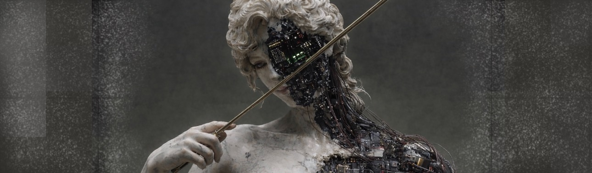

<h1 align="center">Hi, I'm Şafak! 👋 </h1>

<h3 align="center">:hammer_and_wrench: Languages and Tools</h3>

  

    <!-- Left Column: Metrics -->
    

        
    

  

        <h3>🌐 Let's Connect and Grow Together!</h3>
        

            
            </a>
            
            
        

        
  <h3>✨ Fun Facts</h3>
        <ul>
            <li>In my free time, I explore the beauty of nature and capture it through my photography on Instagram.</li>
        </ul>
        
  <h3>🧑‍💻 About Me</h3>
        

            I'm a passionate senior software engineer with a strong background in full-stack development. 
            I have a keen interest in solving complex problems and building scalable solutions. When I'm not coding, you can find me engaged 
            in physical activities like travelling, or planning my next adventure. 
        

        

            My journey in tech has led me to work with various cutting-edge technologies and collaborate with amazing teams across different 
            projects. I’m always eager to learn new things and share my knowledge with the community.
        

    

